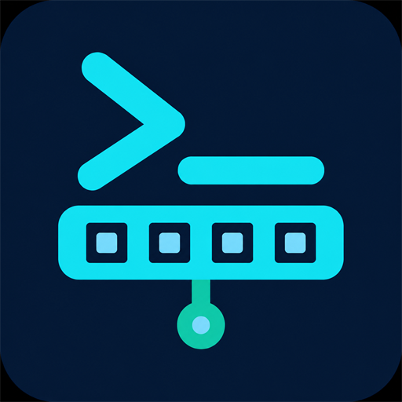

# NetSerial AI 运维终端 V0.6.0



NetSerial AI 是面向网络运维工程师的 Android 移动终端，整合 USB Console、SSH、Telnet、多厂商命令库、Tab/控制键、AI 命令草稿、变更管控、配置对比和现场网络工具。

开发人员：chenwei666

## V0.6.0 新增

- 自动识别 H3C Comware、Huawei VRP、Cisco IOS、Ruijie RGOS；高置信度结果自动切换命令页与 Web 向导。
- 一键 Web 开通向导：按厂商和平台生成 HTTPS/可选 HTTP、账号与密码命令；密码仅在本次发送中使用，预览和证据全部脱敏。
- GitHub Latest 更新检测：支持启动后每日检查和手动检查，只接受 GitHub HTTPS Release 地址。
- AI 一键故障诊断：将脱敏终端输出带入任意已配置 AI 厂商，生成原因、只读检查、修复草案、验证与回退；本地记忆继续按用户授权写入。
- 运维中心：只读健康检查、接口诊断、VLAN 审计、LLDP/CDP 发现、安全基线采集、配置合规初筛和金丝雀优先批次规划。
- 多会话工作区：保存非敏感 SSH/Telnet 连接档案并在 Android 独立任务中并行打开；不保存密码或私钥。
- 配置快照中心：应用私有目录内保存脱敏、规范化、带 SHA-256 的配置快照，并直接进入差异与回退草案。
- Tab 补全 2.0 与自定义命令包：前缀优先、上下文辅助、厂商/视图隔离；自定义命令拒绝密钥和多行脚本。
- USB XMODEM-128 文件发送：CRC/校验和协商、重试、超时、取消、进度与发送前 SHA-256；受 R3 目标与变更门禁保护。
- 保留 V0.5.0 的现代 Material 3、深色模式、四套主题、中英文切换、SSH/Telnet/SFTP 与全部安全能力。

## 核心能力

- USB 串口：驱动探测、波特率、HEX、换行、流控、控制线和后台接收。
- SSH/Telnet：主机密钥校验、密码/键盘交互、会话私钥、跳板机、Keepalive 和 SFTP；Telnet 默认关闭且每次提示明文风险。
- 交换机命令：H3C Comware、Huawei VRP、Cisco IOS、Ruijie RGOS，按设备、接口、VLAN、三层、路由、环路、聚合、安全、排障、保存分类。
- AI：可配置多个内置厂商或自定义 OpenAI-compatible API；API Key 由 Android Keystore 保护；AI 输出只作为待审核草稿，不自动发送。
- 操作安全：R3 二次确认、R4 输入 `EXECUTE`、生产设备变更任务门禁、目标设备防错和敏感内容脱敏。
- 运维工具：IPv4/IPv6 CIDR、DNS、Ping、Traceroute、TCP、路径 MTU、MAC/OUI、常用端口、配置 Diff 和回滚草稿。
- 中英文：设置内可跟随系统或固定简体中文/English。

## 快速使用

1. 在“设备档案”中确认设备名称、厂商、环境和管理地址。
2. 从首页选择 USB 设备，或打开 SSH/Telnet 远程终端。
3. 使用 Tab、方向键、Ctrl+C 和问号快捷键辅助交互。
4. 从“命令库”按厂商和分类搜索；点击只填入/复制，长按可收藏。
5. 在“AI 设置”添加任意支持的厂商或兼容 API，再让 AI 检查、补全、诊断或生成四阶段命令计划。
6. 在“运维中心”识别厂商、生成只读剧本、执行配置合规初筛或建立金丝雀批次计划。
7. 生产变更先建立变更任务，并在结束后导出脱敏 Markdown/PDF 证据。

## 构建

需要 JDK 17 与 Android SDK。Windows 推荐：

```powershell
.\scripts\build.ps1
```

已初始化生产签名的发布工作站：

```powershell
.\scripts\build.ps1 -Release
```

详细边界与验证见 [docs/ARCHITECTURE.md](docs/ARCHITECTURE.md)、[docs/SECURITY.md](docs/SECURITY.md)、[docs/TEST_REPORT.md](docs/TEST_REPORT.md) 和 [docs/RELEASE.md](docs/RELEASE.md)。

## 现场验收要求

自动化验证不能替代真实设备测试。正式用于生产前，请在授权环境验证目标 Android 版本、USB OTG 芯片、四类真实交换机、SSH 私钥/跳板机/SFTP、系统网络工具和自有 AI 账号。所有 AI、Diff 和回滚内容都必须由具备权限的工程师复核。
